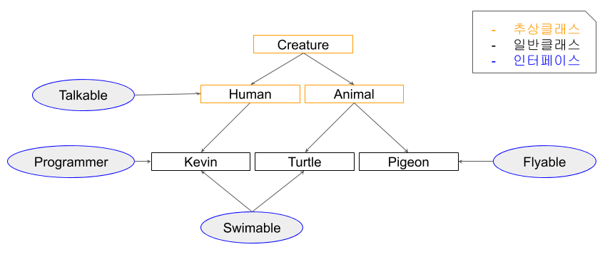

# 객체지향과 추상화(상속, 추상클래스, 인터페이스, 다형성)

<br>

## 추상화(Abstraction)

<br>

###  객체 지향 프로그래밍 키워드 5가지

* 클래스, 인스턴스, 객체
* **추상화**
* **캡슐화**
* **상속**
* **다형성**


### 객체 지향 프로그래밍

* 프로그래밍에서 필요한 데이터를 추상화시켜 상태와 행위를 가진 객체를 만들고 그 객체들 간의 유기적인 상호작용을 통해 로직을 구성하는 프로그래밍 방법
* 컴퓨터 프로그래밍 패러다임 중 하나


### 추상화(자료의 추상화, 추상클래스 & Interface)

* 불필요한 정보는 숨기고 중요한 정보만을 표현함으로써 <u>**공통의 속성이나 기능을 묶어 이름을 붙이는 것**</u>
* 자료의 추상화 = 객체지향 관점에서 클래스를 정의하는 것
* 추상클래스 = 여러 클래스간 비슷한 필드와 메서드를 공통적으로 추출해 만들어진 클래스
* 인터페이스 = 동일한 목적 하에 동일한 기능을 수행하게끔 강제하는 것

> 추상클래스와 인터페이스의 자세한 내용은 아래로.


### 캡슐화

* 기능과 특성의 모음을 `클래스` 라는 `캡슐`에 분류해서 넣는 것
* 기존에는 코드에서 변수와 함수를 재활용하기에는 분산되어 있기 떄문에 재활용이 어려웠음
* 캡슐화를 통해 관련된 기능과 특성을 한 곳에 모으고 분류하기 때문에 재활용이 원활해짐

```
[getter, setter를 사용하는 이유?]

멤버변수에 직접접근하지 못하게 private으로 접근지정자를 설정하고 public으로 getter, setter 메서드를 만드는 것을 많이 해왔다.

그러면서 이럴꺼면 어차피 아무나 접근가능한데 왜 private을 할까? 라고 생각했었다.

결론부터 말하면 getter, setter를 사용하면 메서드를 통해서 접근하기 때문에, 메서드 안에서 매개변수같이 어떤 올바르지 않은 입력에 대해 사전에 처리할 수 있게 제한하거나 조절할 수 있기 때문이다.

예를들면 setter에서 유효범위를 넘은 정수가 들어왔을 때의 처리를 하고나서 set하거나 예외처리를 해버릴 수 있는 것이다.

getter도 마찬가지로 굳이 예를들자면 자료에 무언가 더하거나 빼고 준다든지가 가능하다.


출처: https://jeong-pro.tistory.com/95 [기본기를 쌓는 정아마추어 코딩블로그]
```


### 상속

* 부모클래스의 속성과 기능을 그대로 이어받아 사용할 수 있게하고 기능의 일부분을 변경해야 할 경우 상속받은 자식클래스에서 해당 기능만 다시 수정(정의)하여 사용할 수 있게 하는 것
* 적은 양의 코드로 새로운 클래스 작성 가능
* 코드를 공통적으로 관리할 수 있어 코드의 추가 및 변경 용이

> 자식클래스에서 해당 기능을 다시 수정해 사용할 수 있게 하는 데서 `오버라이딩(다형성)`이 활용

### 다형성

* 하나의 변수명, 함수명 등이 상황에 따라 다른 의미로 해석될 수 있는 것
* 오버라이딩(Overriding): 부모클래스의 메서드와 같은 이름, 매개변수를 재정의 하는 것
* 오버로딩(Overloading): 같은 이름의 함수를 여러개 정의하고, 매개변수의 타입과 개수를 다르게 하여 매개 변수에 따라 다르게 호출할 수 있게 하는 것

<br>

## 추상클래스 & 인터페이스

<br>

### 클래스간의 관계

* 상속 관계: '~는 ~이다.' == (is -a)
* 포함 관계: '~는 ~을 가지고 있다.' == (has -a)

```java
class Circle{
  int x;	// 원점의 x 좌표
  int y;	// 원점의 y 좌표
  int r;	// 원의 반지름
}

class Point{
  int x;	// x 좌표
  int y;	// y 좌표
}
```

원을 표현하기 위한 Circle 클래스와 좌표상의 한 점을 다루기 위한 Point 클래스를 정의했다.

Point 클래스를 재사용해서 Circle 클래스를 작성한다면 다음과 같이 할 수 있다.

```java
class Circle{		// 포함 관계
  Point c = new Point;	// 원점 좌표
  int r;	// 원의 반지름
}

class Point{
  int x;	// x 좌표
  int y;	// y 좌표
}
```

그리고, 다음과 같은 구현도 결과적으로 큰 차이가 없어 보인다.

```java
class Circle extends Point{		// 상속 관계
  int r;	// 원의 반지름
}

class Point{
  int x;	// x 좌표
  int y;	// y 좌표
}
```

이처럼 두 클래스를 어떤 관계로 맺어줄 것인지 헷갈릴 수 있다.

이런 때는 `is-a`와 `has-a`로 비교해가며 상황에 알맞게 설계해줘야 한다.

> 원(Circle)은 점(Point)이다.
>
> 원(Circle)은 점(Point)을 가지고 있다.


### 추상클래스

* 여러 클래스간 비슷한 필드와 메서드를 공통적으로 추출해 만들어진 클래스


### 인터페이스

* 동일한 목적 하에 동일한 기능을 수행하게끔 강제하는 것


### 비교 예제




Creature는 모든 생명체(동식물 - 인간 포함)의 공통 분모로, 실존하진 않지만 공통적으로 적용되는 개념이다.

따라서 Java에서는 이와 같은 경우에 추상클래스를 사용해 표현한다.

```java
package abstract_interface;

public abstract class Creature {
	private int x;
	private int y;
	private int z;
	private int age;
	
	public Creature(int x, int y, int z, int age) {
		this.x = x;
		this.y = y;
		this.z = z;
		this.age = age;
	}

	// 시간이 지나 나이를 먹는다. 
	public void spendTime() {
		age++;
	}
	
	// 움직인다. 
	public void move(int xDistance, int yDistance) {
		x += xDistance;
		y += yDistance;
	}
	
	// 추상 메서드 : 모든 생명체에 필요하지만 각 생명체에 따라 다른 기능으로 구현
	public abstract void attack();		// 공격한다.
	public abstract void printInfo();	// 정보 출력
	
	
	public int getX() {
		return x;
	}

	public void setX(int x) {
		this.x = x;
	}

	public int getY() {
		return y;
	}

	public void setY(int y) {
		this.y = y;
	}

	public int getZ() {
		return z;
	}

	public void setZ(int z) {
		this.z = z;
	}

	public int getAge() {
		return age;
	}

	public void setAge(int age) {
		this.age = age;
	}

	@Override
	public String toString() {
		return "Creature [x=" + x + ", y=" + y + ", z=" + z + ", age=" + age + "]";
	}

}
```


동물 또한, 실존하진 않지만 개, 새, 고양이 등 많은 실존 객체의 공통적인 개념이다. 


```java
package abstract_interface;

public abstract class Animal extends Creature{


	public Animal(int x, int y, int z, int age) {
		super(x, y, z, age);
	}

	@Override
	public void attack() {
		System.out.println("몸을 사용해 공격!!");
	}

}
```


다음은 Human을 만드려고 하는데, 실존하는 대상이라기보다 철수, 영희 등 실존 객체의 공통적인 개념이다. 또, 이와 같은 Human은 말을 할 수 있다는 공통적인 고유한 특징이 있다. 다만 외계인이 등장할 가능성이 있으니, 내부 메서드로 Talk를 구현하지 않고, 별도 인터페이스로 두고 향후 필요한 경우 재사용한다.

```java
package abstract_interface;

public interface Talkable {
	abstract void talk();
}
```

* 인터페이스에 선언한 메서드는 abstract 예약어를 붙이지 않아도 컴파일 과정에서 abstract 메서드로 인식되어 처리된다.


```java
package abstract_interface;

public abstract class Human extends Creature implements Talkable{

	public Human(int x, int y, int z, int age) {
		super(x, y, z, age);
	}

	@Override
	public void attack() {
		System.out.println("도구를 사용해 공격!!");
	}
	
	@Override
	public void talk() {
		System.out.println("사람은 말을 할 수 있다!");
	}
}


```


다음은 실존하는 대상(단위)인 Pigeon을 만드려고 하는데, 동물이면서 날 수 있다는 특성이 있다!

날 수 있는 동물이 Pigeon외에도 여러가지 있으므로, 이런 날 수 있는 것과 관련된 메서드들은 추상메서드로 한 데 묶어 인터페이스로 관리하는게 편하다.

```java
package abstract_interface;

public interface Flyable {
	void fly(int zDistance);
	void flyMove(int xDistance, int yDistance, int zDistance);
}
```

```java
package abstract_interface;

public class Pigeon extends Animal implements Flyable{

	public Pigeon(int x, int y, int z, int age) {
		super(x, y, z, age);
	}

	@Override
	public void fly(int zDistance) {
		setZ(getZ() + zDistance);
	}

	@Override
	public void flyMove(int xDistance, int yDistance, int zDistance) {
		setX(getX() + xDistance);
		setY(getY() + yDistance);
		setZ(getZ() + zDistance);
	}

	@Override
	public void printInfo() {
		System.out.println("Pigeon -> " + toString());
	}

}
```


다음은 실존하는 대상(단위)인 Turtle을 만드려고 하는데, 동물이면서 수영을 할 수 있다는 특성이 있다!

```java
package abstract_interface;

public interface Swimable {
	abstract void swimDown(int zDistance);
}
```

```java
package abstract_interface;

public class Turtle extends Animal implements Swimable{

	public Turtle(int x, int y, int z, int age) {
		super(x, y, z, age);
	}

	@Override
	public void swimDown(int zDistance) {
		setZ(getZ() - zDistance);
	}

	@Override
	public void printInfo() {
		System.out.println("Turtle -> " + toString());
	}
	
}
```


다음은 실존하는 대상(단위)인 Kevin을 만드려고 하는데, 수영도 할 수 있고 프로그래머라는 특성이 있다!

```java
package abstract_interface;

public interface Programmer {
	void coding();
}
```

```java
package abstract_interface;

public class Kevin extends Human implements Swimable, Programmer{

	public Kevin(int x, int y, int z, int age) {
		super(x, y, z, age);
	}

	@Override
	public void swimDown(int zDistance) {
		setZ(getZ() - zDistance);
		if(getZ() < - 10) {
			System.out.println("사람은 너무 깊이 들어가면 죽을 수 있습니다.");
		}
	}

	@Override
	public void printInfo() {
		System.out.println("Kevin -> " + toString());
	}

	@Override
	public void coding() {
		System.out.println("Hello World!!");
	}

}
```

```java

```


### 단일 상속

* C++에서는 여러 조상 클래스로부터 상속받는 것이 가능한 `다중상속`을 허용한다.
* Java에서는 단일 상속만을 허용한다.

> TV, DVD를 상속받는 TvDVD라는 클래스에서 Power() 메서드가 충돌된다면?
>
> 조상클래스의 메서드를 변경하고, 그 메서드를 사용하는 다른 모든 자식 클래스들의 소스까지 수정해줘야 한다. Java에서는 이런 위험을 줄이기 위해 다중상속의 장점을 포기하고 단일 상속만을 허용한다.

<br>

# Quiz

* 객체 지향 프로그래밍이란?
* 추상화란?
* 추상클래스와 인터페이스의 차이

# 출처

* [객체지향 프로그래밍이 뭔가요?](https://jeong-pro.tistory.com/95)
* [자바 추상클래스란?](https://limkydev.tistory.com/188)
* [자바 인터페이스란?](https://limkydev.tistory.com/197?category=957527)
* Java의 정석 - 남궁성
* [추상클래스 VS 인터페이스 왜 사용할까?](https://myjamong.tistory.com/150)

# Quiz 답안

